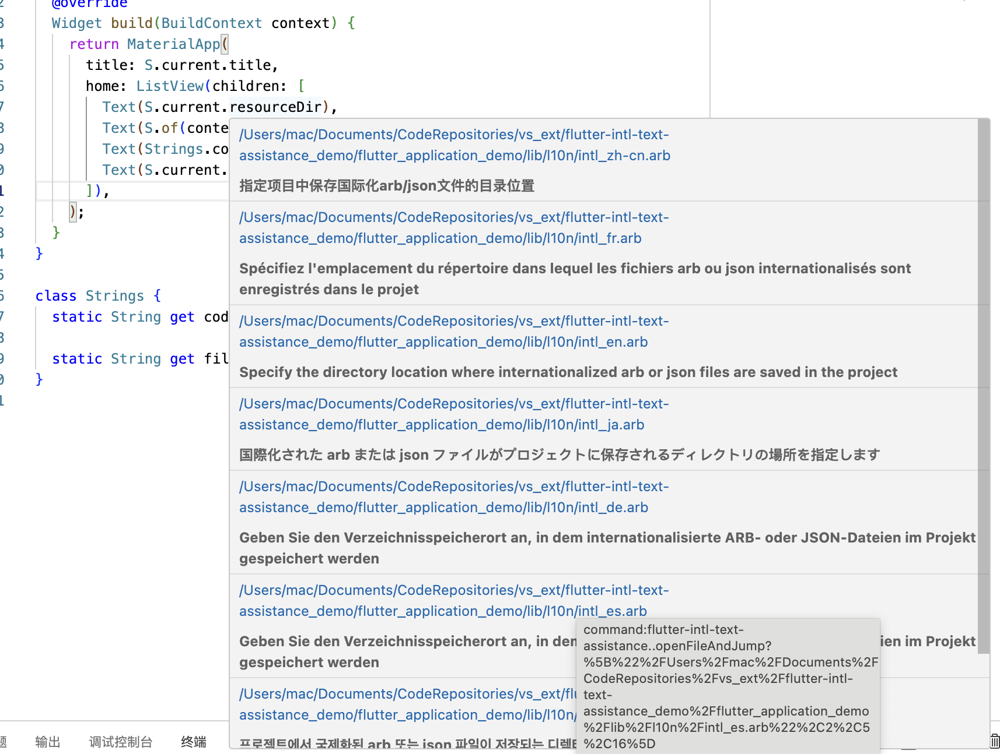
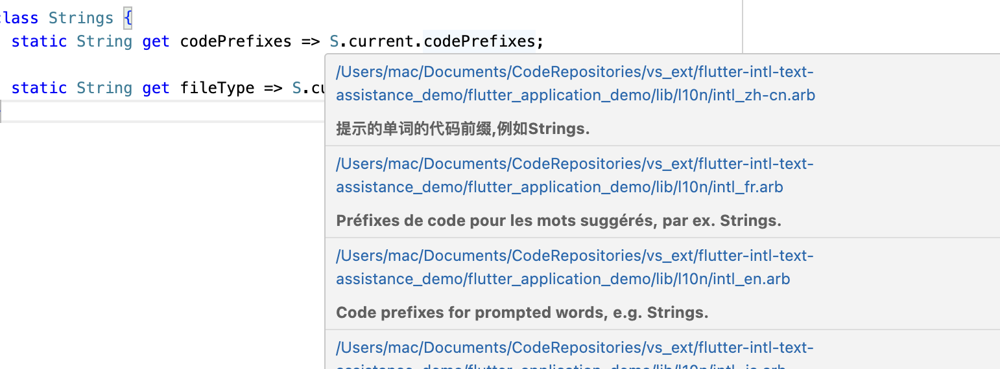

#  Flutter Intl Text Assistance VS Code Extension

 A user friendly plugin to help you work with Flutter Intl in VS Code, for any flutter project. You can easily use it. Flutter Intl international display assistant can quickly display all original translation strings on the code，and can open the translation file.

## Features
### Demo Gif

### With Flutter Intl Text Assistance(Dart file 1)

### With Flutter Intl Text Assistance(Dart file 2)

## Requirements

You need to be a Flutter project, the function will only be enabled on dart code

## Extension Settings

## Known Issues

Email to me

## Release Notes
### 1.1.0
Add Open Translation File

### 1.0.0
Release of Flutter Intl Text Assistance

**Enjoy!**
