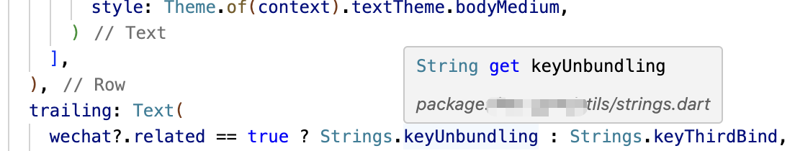
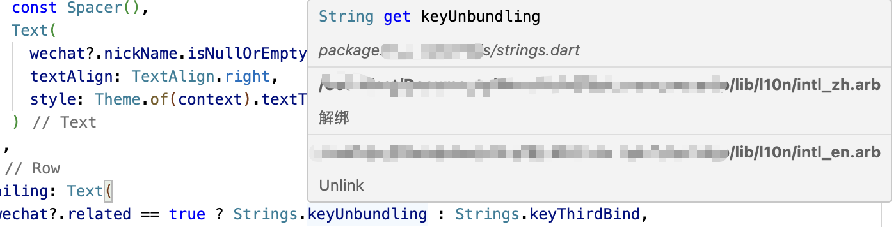
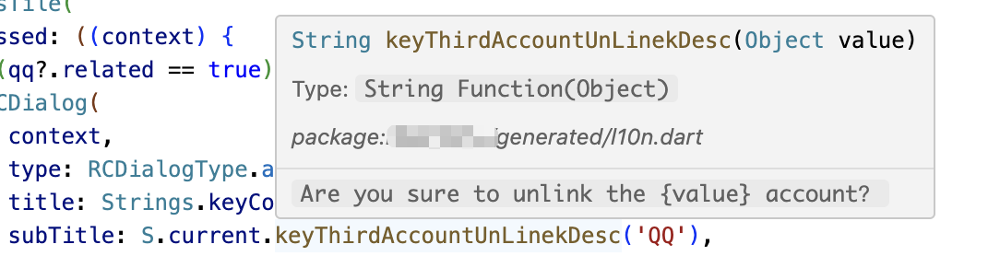
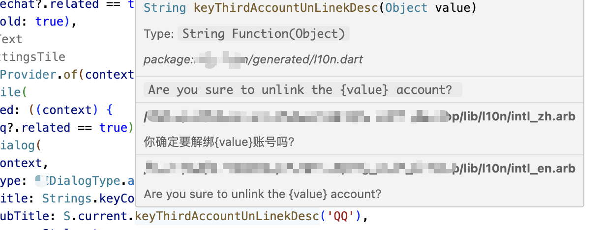

# Welcome to Flutter Intl Text Assistance VS Code Extension

 A user friendly plugin to help you work with Flutter Intl in VS Code, for any flutter project. You can easily use it. Flutter Intl international display assistant can quickly display all original translation strings on the code

## Features

### Without Flutter Intl Text Assistance(Dart file 1)

### With Flutter Intl Text Assistance(Dart file 1)

### Without Flutter Intl Text Assistance(Dart file 2)

### With Flutter Intl Text Assistance(Dart file 2)

